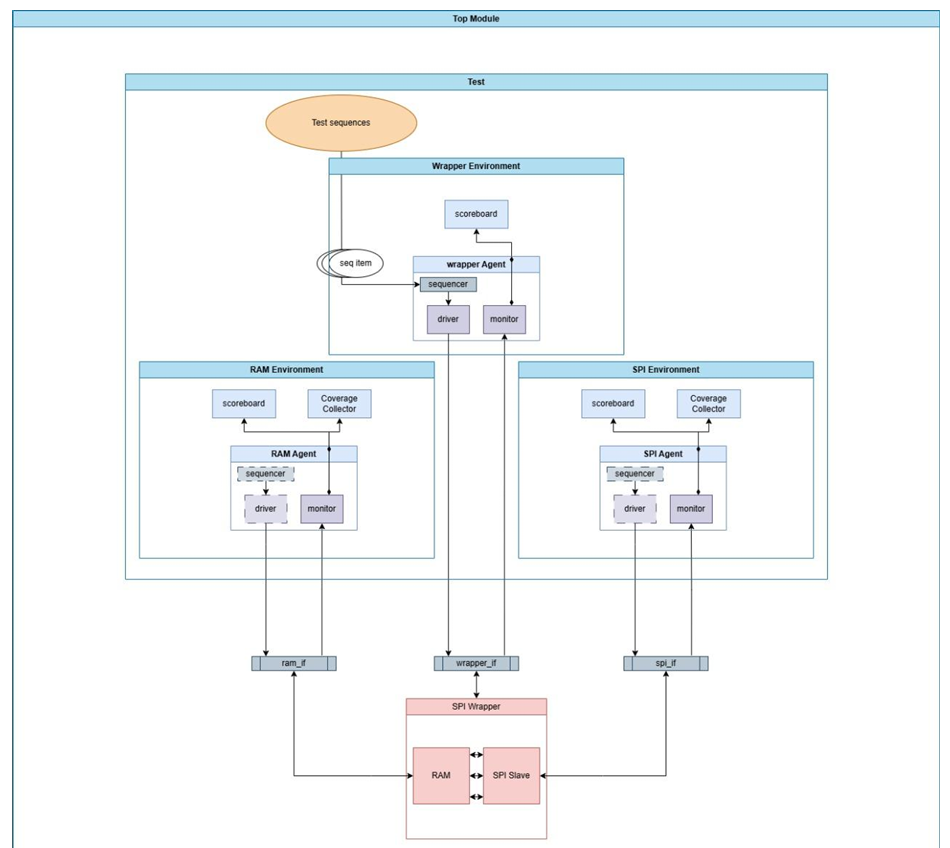
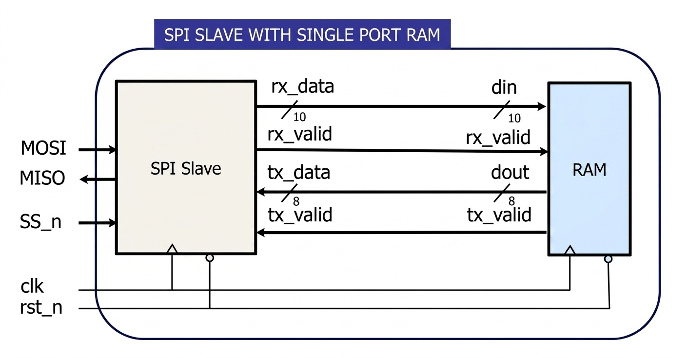
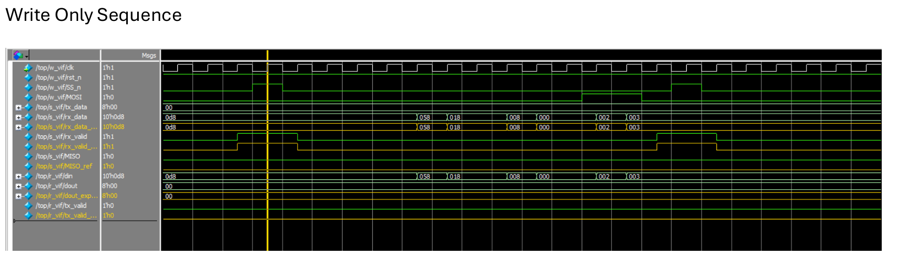
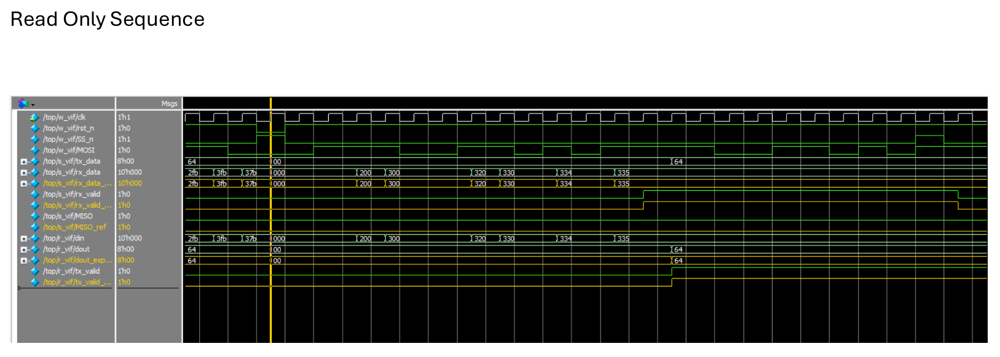
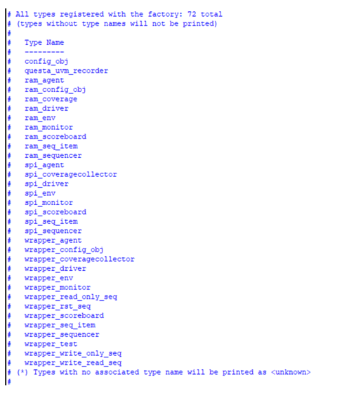

# SPI Wrapper with Single-Port RAM - UVM Verification

## 📌 Project Objective
This project focuses on building and extending Universal Verification Methodology (UVM) environments to verify a complete SPI Wrapper system. The project is executed in three distinct phases, demonstrating the verification of individual components and the powerful reusability of UVM environments during final system integration:
1. **RAM Verification:** Verification of a Single-Port RAM.
2. **SPI Slave Verification:** Verification of the SPI Slave interface.
3. **SPI Wrapper Verification:** End-to-end integration verifying the wrapper by re-using the RAM and SPI Slave environments with passive agents.

---

## 📁 Repository File Structure
The project is organized to separate design, verification packages, and individual component environments.

<p align="center">
  
</p>

---

## 🏗️ UVM Architecture & Testbench Structure
The UVM testbench is designed for modularity and reuse. Below is the architecture showing the integration of the Wrapper Environment.

<p align="center">
  
</p>

### How the UVM Testbench Works
The testbench is driven by a top-level `wrapper_test` which dictates the sequences to be run on the `wrapper_sequencer`. 
* **Component Environments:** The `SPI Environment` and `RAM Environment` were developed independently with their own active agents (Sequencer, Driver, Monitor), Coverage Collectors, and Scoreboards.
* **Wrapper Integration:** In the `Wrapper Environment`, the SPI and RAM agents are switched to **passive mode** (meaning their sequencers and drivers are disabled). They now act purely as monitors to feed transactions to their respective coverage collectors and scoreboards.
* **Wrapper Agent:** A new active `wrapper_agent` is introduced to drive stimuli (MOSI, SS_n) at the wrapper's top-level interface. The top-level scoreboard compares the final MISO output against a Golden Model implemented in Verilog.

---

## 💻 Design Under Test (DUT)
The complete system wraps the SPI Slave and Single-Port RAM components.

<p align="center">
  
</p>

---

## 📊 Verification Plan & Requirements

### Part 1: SPI-Slave Environment
* **Sequences:** `reset_sequence`, `main_sequence`.
* **Constraints:** 
  * `rst_n` deasserted most of the time.
  * `SS_n` high for 1 cycle every 13 cycles (23 cycles for read data).
  * Valid MOSI command combinations only (000, 001, 110, 111).
* **Coverage:** Coverpoints on `rx_data[9:8]`, `SS_n` transaction durations, MOSI transitions, and cross coverage between `SS_n` and MOSI bins.

### Part 2: Single-Port RAM Environment
* **Sequences:** `reset_sequence`, `write_only_sequence`, `read_only_sequence`, `write_read_sequence`.
* **Constraints:** Transaction ordering enforced (e.g., Write Address followed by Write Address/Data, specific probability distributions for randomized read/write operations).
* **Coverage:** Check transaction ordering for `din[9:8]` and cross coverage with `rx_valid` and `tx_valid`.

### Part 3: SPI Wrapper Environment
* **Sequences:** `reset_sequence`, `write_only_sequence`, `read_only_sequence`, `write_read_sequence`.
* Reuses constraints from Part 1 & 2 to drive end-to-end wrapper functionality and maintain realistic protocol traffic on the MOSI/MISO lines.

---

## 🛡️ Assertions Table
Assertions are heavily utilized to guard FSM transitions and validate protocol rules. They are conditionally compiled using the `+define+SIM` macro.

| Feature | Assertion |
| :--- | :--- |
| **SPI Slave: Reset** | Whenever `rst_n` is asserted, MISO, `rx_valid`, and `rx_data` are low. |
| **SPI Slave: Timing** | After valid cmd sequence (000, 001, 110, 111), `rx_valid` asserts exactly after 10 cycles, and `SS_n` closes eventually after 10 cycles. |
| **SPI Slave: FSM** | Guards transitions: `IDLE -> CHK_CMD`, `CHK_CMD -> WRITE/READ_ADD/READ_DATA`, `WRITE/READ_ADD/READ_DATA -> IDLE`. |
| **RAM: Reset** | Whenever `rst_n` is asserted, `tx_valid` and `dout` are low. |
| **RAM: Input Phase** | During address or data input phases, `tx_valid` must remain deasserted. |
| **RAM: Read Data** | After `read_data_seq`, `tx_valid` must rise, and eventually fall after one clock cycle. |
| **RAM: Protocol** | Write Address operation must eventually be followed by Write Data. Read Address must eventually be followed by Read Data. |
| **Wrapper: Reset** | Whenever `rst_n` is asserted, MISO is low. |
| **Wrapper: Stability**| MISO remains stable eventually as long as it is not a read data operation. |

---

## 📈 Coverage Reports

**Functional Coverage & Assertion Coverage:**
The environment achieves 100% functional and assertion coverage (excluding 2-D RAM declaration from toggle coverage).

<p align="center">
  
</p>

<p align="center">
  
</p>

---

## 🌊 Waveforms & Simulation Snippets

**Write Only Sequence:**
<p align="center">
  
</p>

**Read Only Sequence:**
<p align="center">
  
</p>

---

## 🏭 UVM Factory Registration
All environments, agents, sequences, and configurations are successfully registered with the UVM factory.

<p align="center">
  
</p>

---

## 🚀 How to Run the Code

This project uses standard mentor graphics tools (QuestaSim/ModelSim). The compile and run flow is automated using the provided list and DO files.

1. **Clone the repository:**
   ```bash
   git clone <your-repo-url>
   cd <your-repo-directory>
